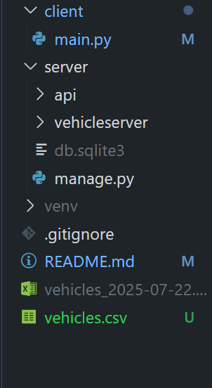

VERO Python Task

This project is a two-part coding task that consists of a Django REST API and a Python CLI client. The goal is to:

- Upload a CSV file containing vehicle data
- Merge it with Baubuddy API vehicle data
- Process and filter the merged data
- Generate a styled Excel file based on request parameters

Project Structure



How to Run
1. Start the Backend (Django)
From the project root:

```bash
cd server
python manage.py runserver
```

API will be available at:  
`http://127.0.0.1:8000/api/upload/`

 2. Prepare the CSV File
 Place your `vehicles.csv` file in the `/client` folder.  
The file must be **semicolon-delimited (;)** and include headers like:

```csv
gruppe;kurzname;langtext;info;lagerort;labelIds
LKW;PB V 1300;MAN 26.440;"Details...";Paderborn;
```

3. Run the Client Script
In a new terminal, navigate to the client folder:

```bash
cd client
python main.py -k kurzname info -c
```
Available Options:
- `-k` or `--keys` → Extra fields to include in Excel (e.g., `kurzname`, `info`)
- `-c` or `--colored` → Enable row coloring based on `hu` date


Excel Output

An Excel file will be generated with this format:

- Filename: `vehicles_YYYY-MM-DD.xlsx`
- Columns: Always includes `rnr`, `gruppe` + any additional `-k` keys
- Coloring (if `-c` enabled):
  - 🟢 Green if `hu` < 3 months old
  - 🟠 Orange if `hu` < 12 months
  - 🔴 Red if `hu` > 12 months

  Authorization (Baubuddy API)
Authentication is handled via a login request. The token is used to authorize further API calls.

 ✅ Features Implemented
- [x] Django REST endpoint for CSV upload and Baubuddy merge
- [x] Authentication & label color resolution
- [x] Filtering based on `hu` and label existence
- [x] CLI client with `argparse` and `requests`
- [x] Excel generation with OpenPyXL and row coloring

Requirements
- Python 3.10+
- Django 4+
- openpyxl
- requests

> Install dependencies using `pip install -r requirements.txt` (if requirements file is added)

Contact

Prepared by Ferit Yaşar for VERO Digital Solutions recruitment task.  
GitHub: [github.com/feritya](https://github.com/feritya)
E-mail:yasarferit13@gmail.com
